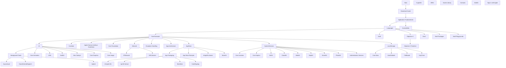

# ios-developer-roadmap

```mermaid
  graph TD;
	  Start
	  Fundamentals[Application Fundamentals]
	  Languages
    CoreConcepts
    AppArchitecture[App Architecture]

	  Xcode[Download Xcode]
	  Swift
	  Objective-C
	  SwiftUI
	  UIKit
    AppPackaging[App Packaging]
    IPA[Ipa file format]
    InfoPlist[Info.plist file]

	  HIG[Apple Human Interface Guidelines]
    Combine
	  CoreFoundation[Core Foundation]
	  DocC
    Network
	  CFNetwork
    URLSession
	  ExceptionHandling[Exception Handling]


	  CoreData
	  Accessibility
	  AppStore
	  Receipts[App Store Receipts]
	  CryptoKit
	  ARKit
	  Assets[Assets Library]
	  Authentication[Authentication Services]
	  Background[Background Tasks]
	  CloudKit
	  
	  Contacts
	  CoreAnimation[Core Animation]
	  CoreData[Core Data]
	  CoreGraphics[Core Graphics]
	  CoreHaptics[Core Haptics]
	  CoreImage[Core Image]
	  CoreLocation[Core Location]
	  EventKit
	  Catalyst[Mac Catalyst]
	  MailKit
	  MapKit
	  ObjcRuntime[Objective-C Runtime]
	  PhotoKit
	  SiwA[Sign in with Apple]
	  SiriKit
	  StoreKit
	  Packages[Swift Packages]
	  Playgrounds[Swift Playgrounds]
	  WebKit

	  Start-->Xcode;
	  Xcode-->Fundamentals
	  Fundamentals-->Languages
    Languages-->CoreConcepts
    CoreConcepts-->UI
    UI-->Background
    Fundamentals-->Accessibility
    UI-->CoreAnimation
    UI-->UIKit
    UI-->SwiftUI
    UI-->Catalyst
    UI-->CoreGraphics
    UI-->CoreImage
    Background-->AsyncAwait
    Background-->GrandCentralDispatch
    Background-->Implicit


	  Languages-->Swift
	  Languages-->Objective-C
    Objective-C-->ObjcRuntime
    Languages-->DocC
    Languages-->Packages
    Languages-->Playgrounds
    CoreConcepts-->Combine
    CoreConcepts-->HIG
    CoreConcepts-->CoreFoundation
    CoreConcepts-->Network
    CoreConcepts-->ExceptionHandling
    CoreConcepts-->AppArchitecture
    AppStore-->AppPackaging
    AppPackaging-->InfoPlist
    AppPackaging-->IPA
    AppPackaging-->Manifests
    AppPackaging-->CodeSigning
    CoreConcepts-->AppStore
    AppStore-->Receipts
    AppStore-->InAppPurchases
    AppStore-->StoreKit
    
    CoreConcepts-->SystemServices

    CoreConcepts-->LocalStorage
    LocalStorage-->CoreData
    LocalStorage-->UserDefaults
    LocalStorage-->FileBased
    LocalStorage-->KeyChain

    SystemServices-->CoreLocation
    SystemServices-->CoreHaptics
    SystemServices-->SiriKit
    SystemServices-->CloudKit
    SystemServices-->WebKit
    SystemServices-->MapKit
    SystemServices-->EventKit
    SystemServices-->PhotoKit
    SystemServices-->Authentication

    Network-->CFNetwork
    Network-->URLSession

	  click Xcode "https://developer.apple.com/xcode/" _blank
	  click Swift "https://developer.apple.com/learn/curriculum/"
	  click SwiftUI "https://developer.apple.com/tutorials/swiftui" _blank
```
